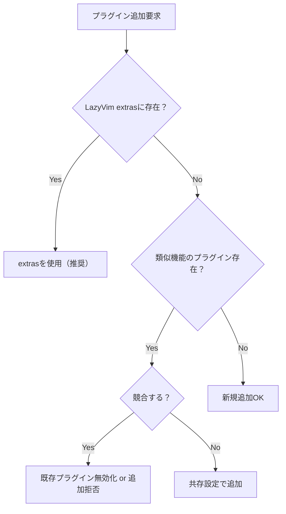

# CLAUDE.md

This file provides guidance to Claude Code (claude.ai/code) when working with code in this repository.

## 🤖 Claude Code専用管理システム

このNeovim設定は**完全Claude Code管理**です。以下の手順とツールを必ず使用してください。

### 必須：変更前チェック
```bash
# 1. 現在状態をバックアップ
git stash push -m "backup_$(date +%Y%m%d_%H%M%S)"

# 2. 設定整合性テスト実行
nvim --headless -c "lua require('tests.config_tests').run_all_tests()" -c "qall"

# 3. パフォーマンス測定
nvim --startuptime /tmp/startup_before.log +qall
```

### 必須：変更後検証
```bash
# 1. 整合性テスト再実行
nvim --headless -c "lua require('tests.config_tests').run_all_tests()" -c "qall"

# 2. 起動時間比較
nvim --startuptime /tmp/startup_after.log +qall
diff /tmp/startup_before.log /tmp/startup_after.log

# 3. エラーチェック
nvim --headless -c "checkhealth" -c "qall"
```

### 緊急復旧コマンド
問題が発生した場合は即座に実行：
```bash
git stash apply  # 最新バックアップから復旧
```

## Task Tracking

今後実装予定の機能や改善点については `tasks/list.md` を参照してください。
タスクの対応を開始する際は以下の手順に従ってください：

1. `tasks/list.md` から対応するタスクの `taskNo` を確認
2. `tasks/TASK-{taskNo}.md` ファイルを作成
3. 調査・実装・テストの過程を都度記録
4. 完了後、`tasks/list.md` のチェックマークを `[x]` に更新

**記録すべき内容:**
- 要件分析と設計内容
- 実装方針とアプローチ
- 関連する設定やプラグイン
- テスト内容と結果
- 完成した機能の使用方法

## Bug Tracking

発生したバグや問題点については `bugs/list.md` を参照してください。
問題が修正されたら該当項目のチェックマークを `[x]` に更新してください。

### バグ管理システム

各バグには一意の `issueNo` が割り当てられています。
バグの対応を開始する際は以下の手順に従ってください：

1. `bugs/list.md` から対応するバグの `issueNo` を確認
2. `bugs/BUG-{issueNo}.md` ファイルを作成
3. 調査・修正・テストの過程を都度記録
4. 修正完了後、`bugs/list.md` のチェックマークを `[x]` に更新

**記録すべき内容:**
- 調査内容と発見事項
- 試した修正方法とその結果
- 依存関係や関連する設定
- テスト結果
- 最終的な解決方法

この方式により、バグの対応履歴を保持し、類似問題への対応や設定変更の影響を追跡できます。

## Configuration Architecture

This is a **LazyVim-based** Neovim configuration with Japanese language support. The configuration follows LazyVim's modular architecture:

- `init.lua` - Entry point that bootstraps lazy.nvim
- `lua/config/` - Core configuration files that extend LazyVim defaults:
  - `lazy.lua` - Plugin manager setup with TypeScript, Python, Docker language extras
  - `options.lua` - Japanese locale settings and startup behavior
  - `keymaps.lua` - Custom keybindings for navigation and terminal management
  - `autocmds.lua` - Disabled LazyVim's spell checking
- `lua/plugins/` - Plugin-specific configurations that override or extend LazyVim defaults

## Key Configuration Details

### Language and Locale
- **Japanese language support** enabled with `helplang = { "ja", "en" }` and `language messages ja_JP.UTF-8`
- Spell checking is **globally disabled** for all file types
- LazyVim's markdown spell checking is explicitly removed

### Plugin Management
- Uses **lazy.nvim** with LazyVim as base
- LuaRocks support is **disabled** (`rocks.enabled = false`)
- Automatic plugin update checking enabled but notifications disabled
- Performance optimizations: several default vim plugins disabled (gzip, tarPlugin, etc.)

### Terminal Integration (ToggleTerm)
- Default terminal opens in **vertical split** (80 columns width)
- Custom terminal functions for lazygit, python3, node, and htop
- Comprehensive keybinding scheme under `<leader>t*` prefix
- Terminal-specific keymaps: `<Esc>` for normal mode, numbered terminal access

### Claude Code Integration
- Plugin: `coder/claudecode.nvim` 
- Keybindings under `<leader>c*` prefix:
  - `<leader>cc` - Start chat
  - `<leader>cr` - Reset chat
  - `<leader>ca` - Ask about visual selection (visual mode)
  - `<leader>ca`/`<leader>cd` - Accept/deny diffs

### Custom Keybindings
- **Neo-tree toggle**: `<Leader>e`
- **Buffer navigation**: `<C-PageDown>`/`<C-PageUp>` (next/previous)
- **Buffer close**: `<F15>` (mapped from iTerm2)
- **Live grep**: `<F16>` maps to `<leader>/` (iTerm2 integration)
- **Terminal toggle**: `<C-`>` and `<leader>tt`

### Keyball User Configuration Notes
The user uses **Keyball** (advanced keyboard with trackball and many thumb keys), enabling extensive shortcut key usage and seamless mouse operations.

#### Keyboard Features
1. **Feel free to suggest complex key combinations**
   - Multi-modifier combinations (e.g., `<C-S-A-key>`)
   - Function keys with modifiers
   - Extensive use of Leader key combinations

2. **Layer-friendly suggestions**
   - Thumb cluster keys are easily accessible
   - Can utilize more aggressive keybinding schemes
   - No need to limit to simple/ergonomic defaults

3. **Keybinding Strategy**
   - Group related functions under consistent prefixes
   - Use mnemonic key choices liberally
   - Can assign shortcuts to less frequently used features

#### Mouse Integration Features
Since Keyball provides seamless mouse control:

1. **Click-based Context Switching**
   - Clicking on different areas should optimize the interface
   - Window focus should trigger appropriate mode changes
   - Consider implementing smart click zones

2. **Suggested Mouse Enhancements**
   ```lua
   -- Enable mouse support
   vim.opt.mouse = "a"
   
   -- Example: Click on Neo-tree to focus and expand
   -- Example: Click on terminal to auto-enter insert mode
   -- Example: Click on split borders to resize
   ```

3. **Hybrid Operations**
   - Design for keyboard-mouse combination workflows
   - Quick mouse positioning + keyboard commands
   - Gesture-like operations with modifier keys

## Claude Code必須操作コマンド

### 🔧 変更前の必須準備
```bash
# 1. バックアップ作成
git stash push -m "backup_$(date +%Y%m%d_%H%M%S)"

# 2. 現在の起動時間記録
nvim --startuptime /tmp/startup_before.log +qall && tail -1 /tmp/startup_before.log

# 3. 設定整合性確認
nvim --headless -c "lua require('tests.config_tests').run_all_tests()" -c "qall"
```

### ⚡ 変更後の必須検証
```bash
# 1. 整合性テスト
nvim --headless -c "lua require('tests.config_tests').run_all_tests()" -c "qall"

# 2. 起動時間比較
nvim --startuptime /tmp/startup_after.log +qall && echo "Before/After:" && tail -1 /tmp/startup_before.log && tail -1 /tmp/startup_after.log

# 3. 健全性チェック
nvim --headless -c "checkhealth" -c "qall"
```

### 🚨 緊急復旧
```bash
# 問題発生時は即座に実行
git stash apply
```

### 📊 日常メンテナンス
```bash
# プラグイン更新（手動実行推奨）
nvim -c "Lazy update" -c "qa"

# 設定の健全性確認
nvim -c "TestNvimConfig"

# パフォーマンス分析
nvim -c "Lazy profile"
```

### 🎯 ターミナル操作
- 複数ターミナル: `<leader>t1-t4`
- LazyGit: `<leader>tg` 
- Python REPL: `<leader>tp`
- Node REPL: `<leader>tn`

## File Structure Patterns

- **Plugin configurations** in `lua/plugins/*.lua` follow lazy.nvim spec format
- Each plugin file returns a table with plugin specification
- Custom keybindings defined in `keys` section of plugin specs
- Configuration in `config` function with `setup()` calls

## Japanese-Specific Features

- Help system prioritizes Japanese documentation
- UI messages displayed in Japanese
- Neo-tree opens automatically on startup when no files specified
- Spell checking completely disabled to avoid conflicts with Japanese text

## Plugin Configuration Standards

### Unified Configuration Pattern

All plugin configurations in `lua/plugins/` follow these patterns for consistency and performance:

1. **Basic Pattern with `opts`** (Preferred for simple configs):
```lua
return {
  "plugin/name",
  opts = {
    -- configuration options
  },
}
```

2. **Pattern with `opts` function** (For extending LazyVim defaults):
```lua
return {
  "plugin/name",
  opts = function(_, opts)
    -- modify opts
    return opts
  end,
}
```

3. **Pattern with `config` function** (Only when complex setup needed):
```lua
return {
  "plugin/name",
  config = function(_, opts)
    require("plugin").setup(opts)
    -- additional setup code
  end,
}
```

### Performance Optimization Guidelines (2024年最新版)

1. **必須：遅延読み込み設定** - 全てのプラグインで指定:
   - `event = "VeryLazy"` - 一般的なプラグイン用
   - `event = "BufRead"` - ファイル読み込み時
   - `cmd = "CommandName"` - コマンド実行時のみ
   - `keys = { "<leader>x" }` - キー使用時のみ
   - `ft = { "typescript", "javascript" }` - 特定ファイルタイプ

2. **パフォーマンス最適化**:
   - Pythonプロバイダー明示設定（options.lua:8-10で実装済み）
   - 不要なruntimeプラグイン無効化（lazy.lua:46-60で実装済み）
   - `opts`パターンを`config`より優先使用

3. **キーマップ統合** - プラグインspec内で定義:
```lua
keys = {
  { "<leader>xx", "<cmd>Command<cr>", desc = "Description" },
  { "<leader>xy", function() ... end, desc = "Description", mode = "v" },
}
```

### Example: Well-Configured Plugin
```lua
return {
  "author/plugin-name",
  dependencies = { "required/dependency" },
  event = { "BufRead", "BufNewFile" }, -- or cmd/keys/ft
  keys = {
    { "<leader>p", "<cmd>PluginCommand<cr>", desc = "Plugin action" },
  },
  opts = {
    setting1 = true,
    setting2 = "value",
  },
}
```

### Configuration Rules (2024年ベストプラクティス)

1. **優先度**：`opts` > `opts function` > `config function`
2. **必須**：全プラグインで遅延読み込み設定（`event`, `cmd`, `keys`, `ft`）
3. **統合**：キーマップはプラグインspec内で定義（keymaps.luaではなく）
4. **最小化**：設定は必要最小限に留める
5. **文書化**：重要な設定に日本語コメント
6. **パターン統一**：既存コードの命名規則・構造に従う
7. **パフォーマンス重視**：起動時間100ms以下を目標

## Claude Code向けプラグイン追加手順

### ⚠️ 必須：追加前の安全確認
```bash
# 必ず実行：現在の状態をバックアップ
git stash push -m "before_plugin_$(date +%Y%m%d_%H%M%S)"
```

### 1. プラグイン追加時の判断基準


### 2. 必須テンプレート（Claude Code用）
```lua
return {
  "author/plugin-name",
  -- 🚨必須：遅延読み込み（起動時間維持のため）
  event = "VeryLazy", -- または cmd/keys/ft
  
  -- 🔧推奨：キーマップ統合（keymaps.luaではなく）
  keys = {
    { "<leader>xx", "<cmd>Command<cr>", desc = "機能説明" },
  },
  
  -- ⚡必須：optsパターン優先（configは最後の手段）
  opts = {
    enable = true,
    -- 重要な設定のみ記述、詳細はコメントで説明
  },
}
```

### 3. Claude Code専用チェックリスト
プラグイン追加後、以下を必ず実行：
```bash
# A. 整合性テスト
nvim --headless -c "lua require('tests.config_tests').run_all_tests()" -c "qall"

# B. 起動時間チェック（78ms以下維持）
nvim --startuptime /tmp/startup_check.log +qall
tail -1 /tmp/startup_check.log

# C. キーマップ競合チェック
nvim -c "WhichKey" -c "qa"

# D. 日本語環境確認
nvim -c "echo &helplang" -c "qa"
```

### 4. 失敗時の即座復旧
```bash
# 問題があれば即座に前の状態に戻す
git stash apply
```

---

## 🚨 Claude Code運用の絶対ルール

### 変更実行前の必須手順
1. **現在状態バックアップ**: `git stash push -m "backup_$(date +%Y%m%d_%H%M%S)"`
2. **テスト実行**: `nvim --headless -c "lua require('tests.config_tests').run_all_tests()" -c "qall"`
3. **パフォーマンス測定**: `nvim --startuptime /tmp/startup_before.log +qall`

### 変更実行後の必須検証
1. **再テスト**: `nvim --headless -c "lua require('tests.config_tests').run_all_tests()" -c "qall"`
2. **パフォーマンス確認**: `nvim --startuptime /tmp/startup_after.log +qall`
3. **健全性チェック**: `nvim --headless -c "checkhealth" -c "qall"`

### 問題発生時の緊急復旧
```bash
git stash apply  # 即座に前の状態に復帰
```

### Claude Codeで使用可能なテストコマンド
```bash
# 設定整合性テスト（Neovim内から）
:TestNvimConfig

# パフォーマンス分析
:Lazy profile

# 健全性チェック
:checkhealth

# キーマップ確認
:WhichKey
```