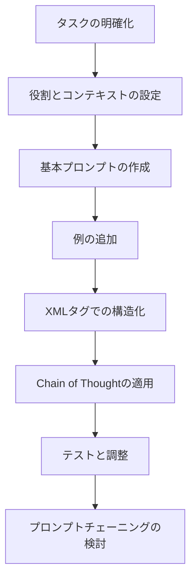

# Claude 4 プロンプトエンジニアリング ベストプラクティス

## 概要

このドキュメントは、Claude 4（Opus 4 及び Sonnet 4）のプロンプトエンジニアリングのベストプラクティスをまとめたものです。特に Claude Code での指示プロンプト設計に重点を置き、実際の処理フローを分析した効果的な技術を提供します。

**参考リソース:**

- [Claude 4 best practices](https://docs.anthropic.com/en/docs/build-with-claude/prompt-engineering/claude-4-best-practices)
- [Prompt Engineering Overview](https://docs.anthropic.com/en/docs/build-with-claude/prompt-engineering/overview)

---

## Part 1: Claude Code 指示プロンプト設計

### Claude Code の実際の処理フロー

### Phase 1: 構造認識 (0.1 秒)

- XML タグの存在確認 → 構造化プロンプトとして優先処理
- リスト形式の検出 → 実行可能タスクとして認識
- 段落密度の判定 → 読み込み深度を調整

### Phase 2: 重要度スキャン (0.1-1 秒)

- 大文字キーワード（`NEVER`, `YOU MUST`）を視覚的抽出
- 理由説明（「なぜなら」「because」「そのため」）を持つ指示を優先認識
- 具体例とコードブロックの位置確認

### Phase 3: 意図理解 (1-3 秒)

- 文脈の連鎖：指示間の論理的つながりを把握
- 制約の階層化：絶対禁止 > 必須 > 推奨
- 参照解決：他ファイルへの依存関係把握

### Phase 4: 行動計画 (3-5 秒)

- 並列実行可能性の判定
- エラー予防ポイントの認識
- 完了基準と検証方法の確認

## 効果的なプロンプト要素（影響度順）

### S 級 - 即座に行動変更

#### 1. XML タグ + 理由説明

```xml
<context>
レビュワーが効率的にコードレビューを行うためには、実装結果を視覚的に確認できることが不可欠です。
スクリーンショットなしでは、レビュワーは自分で環境を構築して動作確認する必要があり、レビュー時間が大幅に増加します。
</context>
```

#### 2. 実行可能チェックリスト

```
- [ ] 具体的な行動：`pnpm run test`
- [ ] 失敗時の対応：テストが失敗した場合は、エラーメッセージを分析し、関連するコードを修正する
```

### A 級 - 強い行動規制

#### 1. NEVER + 具体的理由

```
NEVER: テストを実行せずにコードをコミットすること
理由: テストを実行しないと、リグレッションやバグが本番環境に混入するリスクが高まるため
```

#### 2. 明確な参照指示

```
`prompt/workflow/validator-workflow.md` に従って最終検証を実行
```

### B 級 - 品質向上

- 具体的な実行例
- 並列処理の指示（「複数の独立した操作がある場合は同時に実行」）
- エラーハンドリング要求

## プロンプト作成の実践パターン

### 基本テンプレート

```xml
<context>
[なぜこの作業が重要なのかの説明]
</context>

<workflow>
以下の手順を順番に実行してください：

1. [ ] [具体的な行動1]
   - 失敗時：[対応方法]

2. [ ] [具体的な行動2]
   - 参照：`path/to/guide.md`

3. [ ] [具体的な行動3]
</workflow>

NEVER: [絶対禁止事項] - [理由]
```

### 効率化パターン

```
複数の独立した作業がある場合は、並列で実行してください：
- [ ] タスク1の実行
- [ ] タスク2の実行
- [ ] タスク3の実行
```

### エラー予防パターン

```
以下の確認を必ず実行：
- [ ] 前提条件チェック：[具体的なコマンド]
- [ ] 実行：[メイン作業]
- [ ] 検証：[結果確認方法]
- [ ] クリーンアップ：[後処理]
```

## よくある失敗パターンと対策

### ❌ 失敗パターン

```
分析ダッシュボードを作成してください
```

→ 曖昧で具体的な行動に結びつかない

### ✅ 改善パターン

```xml
<context>
レビュワーが実装を効率的に確認できるよう、完全に機能するダッシュボードが必要です。
</context>

<requirements>
- [ ] データ表示機能の実装
- [ ] フィルタリング機能の追加
- [ ] エクスポート機能の実装
- [ ] レスポンシブデザイン対応
</requirements>

参照：`prompt/guide/frontend-component-guide.prompt.md`
```

## 強調表現の使い分け

### 絶対禁止（最優先）

- `NEVER` - セキュリティ・データ整合性に関わる事項
- `Absolute Prohibitions` - プロジェクト制約

### 必須要件

- `YOU MUST` - 品質保証・標準遵守
- `CRITICAL` - ワークフロー・プロセス

### 推奨事項

- `IMPORTANT` - ベストプラクティス
- 一般的な指示

## 検証

効果的なプロンプトの特徴：

- [ ] XML タグで構造化されている
- [ ] 各指示に理由が説明されている
- [ ] 具体的な実行手順がある
- [ ] 失敗時の対応が明記されている
- [ ] 参照すべきファイルが明確
- [ ] 並列実行可能な部分が特定されている

---

## Part 2: 基本的なプロンプト工学

### 1. 明確性と直接性

Claude 4 は明確で明示的な指示に対してより良い応答を示します。

**❌ 良くない例:**

```
分析ダッシュボードを作成してください
```

**✅ 良い例:**

```
分析ダッシュボードを作成してください。可能な限り多くの関連機能と相互作用を含めてください。基本機能を超えて、完全に機能的な実装を作成してください。
```

### 2. 例の活用（マルチショットプロンプティング）

- **精度向上**: 誤解を減らし、期待する出力に近づける
- **一貫性確保**: 統一された構造とスタイルを維持
- **複雑なタスクの成功率向上**: 3-5 個の多様で関連性の高い例を提供

```xml
<examples>
<example>
入力: [入力例1]
期待する出力: [出力例1]
</example>
<example>
入力: [入力例2]
期待する出力: [出力例2]
</example>
</examples>
```

### 3. 思考の連鎖（Chain of Thought）

#### 基本的な CoT

```
ステップバイステップで考えてください。
```

#### 構造化 CoT

```xml
<thinking>
1. ドナーの寄付履歴と過去のキャンペーン支援から響くメッセージを検討
2. Care for Kidsプログラムで魅力的な側面を特定
3. 分析に基づくパーソナライゼーション戦略
</thinking>

最終的なメールを<email>タグで作成してください。
```

### 4. XML タグによる構造化

#### 推奨タグ

- `<instructions>`: 指示内容
- `<example>` / `<examples>`: 例示
- `<context>`: 背景情報
- `<format>`: 出力形式の指定
- `<thinking>`: 思考プロセス
- `<answer>`: 最終回答

---

## Part 3: Claude 4 特有の機能

### 拡張思考（Extended Thinking）の活用

#### 技術的考慮事項

- **最小思考予算**: 1024 トークンから開始
- **段階的増加**: 必要に応じて思考予算を調整
- **バッチ処理**: 32K 以上の思考が必要な場合は推奨
- **英語での思考**: 最適なパフォーマンスのため（最終出力は任意の言語可）

#### 効果的な指示

```
❌ 具体的すぎる指示:
この数学問題をステップバイステップで考えてください:
1. まず変数を特定してください
2. 次に方程式を設定してください

✅ 推奨される指示:
この数学問題について徹底的かつ詳細に考えてください。
複数のアプローチを検討し、完全な推論を示してください。
```

### 長いコンテキストでのプロンプティング（200K トークンの活用）

#### データ配置の最適化

```xml
<!-- 長文書類を上部に配置 -->
<documents>
  <document index="1">
    <source>annual_report_2023.pdf</source>
    <document_content>
      {{ANNUAL_REPORT}}
    </document_content>
  </document>
</documents>

<!-- クエリを最後に配置 -->
年次報告書を分析し、戦略的優位性を特定してQ3の重点分野を推奨してください。
```

### プロンプトチェーニング

複雑なタスクを小さく管理しやすいサブタスクに分割する手法。

```xml
<!-- Step 1: 要約生成 -->
研究論文を要約してください:
<paper>{{RESEARCH_PAPER}}</paper>

<!-- Step 2: 要約の評価 -->
以下の要約を評価してください:
<summary>{{STEP1_OUTPUT}}</summary>
精度、明確性、完全性の観点から評価し、改善点を提案してください。
```

---

## Part 4: 実用的な技術

### 並列ツール呼び出しの最適化

Claude 4 は並列ツール実行に優れています。

```
最大限の効率性のために、複数の独立した操作を実行する必要がある場合は、
すべての関連ツールを順次ではなく同時に呼び出してください。
```

### フロントエンドコード生成の向上

#### 基本的な激励

```
遠慮しないでください。全力を尽くしてください。
```

#### 詳細な修飾語

- 「可能な限り多くの関連機能と相互作用を含める」
- 「ホバー状態、トランジション、マイクロインタラクションなどの思慮深い詳細を追加」
- 「設計原則を適用: 階層、コントラスト、バランス、動き」

### 画像プロンプティングのベストプラクティス

#### 基本戦略

1. **画像の配置**: 画像をプロンプトの最初に配置
2. **複数画像の処理**: タグで各画像を明確にラベル付け
3. **詳細な説明**: 複雑なチャートやグラフィックスでは詳細な説明を要求

```
以下のスライドデッキの各スライドについて詳細に説明してください:

<slide1>
[画像1]
</slide1>

<slide2>
[画像2]
</slide2>
```

---

## Part 5: 実践的なワークフロー

### プロンプト作成フロー



### トラブルシューティング

| 問題                 | 解決策                               |
| -------------------- | ------------------------------------ |
| 応答が曖昧           | より具体的な指示と例を追加           |
| 形式が不正確         | XML タグでの構造化と出力例の明確化   |
| 複雑なタスクでの失敗 | プロンプトチェーニングの適用         |
| 思考プロセスが不十分 | 拡張思考モードの活用                 |
| 一貫性の欠如         | マルチショットプロンプティングの使用 |

---

## まとめ

Claude 4 の力を最大限に活用するためのキーポイント:

1. **Claude Code 向け指示**: XML タグ + 理由説明 + チェックリスト形式
2. **明確さが重要**: 具体的で詳細な指示を提供
3. **例の力**: 3-5 個の多様な例で期待を明確に伝達
4. **構造化**: XML タグでプロンプトと応答を整理
5. **思考の活用**: 複雑なタスクには拡張思考を活用
6. **段階的アプローチ**: 複雑なタスクはプロンプトチェーニングで分割
7. **継続的な改善**: テストと調整を通じてプロンプトを最適化
